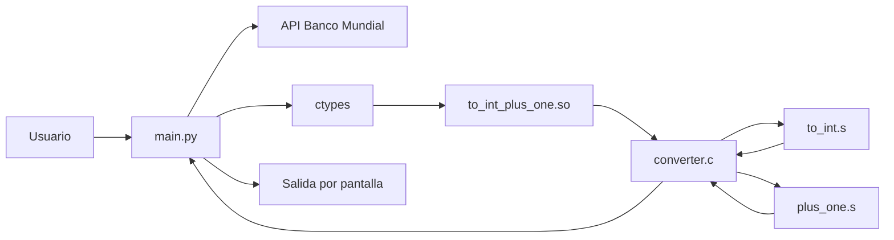
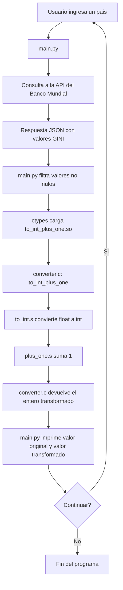
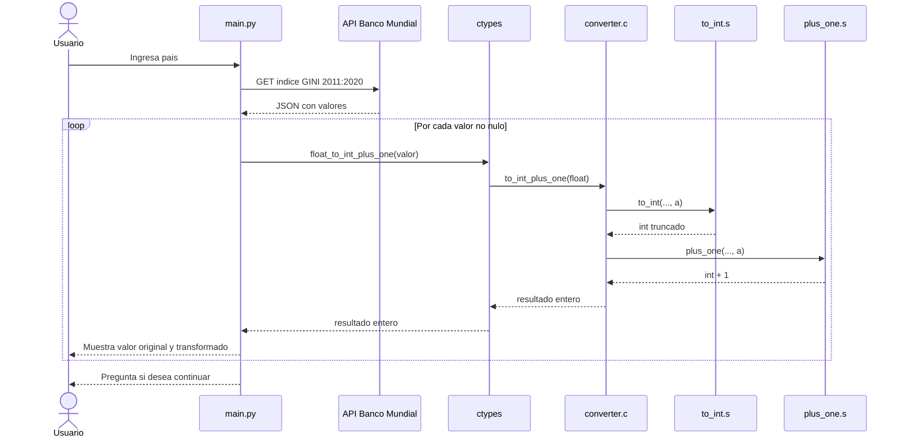

# TP2-Stack-Frame
Este el repositorio del trabajo práctico N° 2 de la materia de Sistemas de Computación

## Grupo
- *Ataque x86*

## Integrantes
-  *Arnaudo, Federico Andres*
-  *Perotti, Franco José*
- 

# Script de Python - main.py

Este programa en Python consulta la API del Banco Mundial para obtener valores del índice GINI de un país ingresado por el usuario (entre 2011 y 2020). 

Luego, utiliza la librería `ctypes` para cargar una biblioteca compartida escrita en C (`converter.so`) y llamar a una función que convierte cada valor flotante en entero y le suma uno. 

Finalmente, muestra tanto el valor original como el valor transformado, repitiendo el proceso hasta que el usuario decida finalizar.

## Diagramas del sistema

### 1. Diagrama de bloques




### 2. Flujo general



### 3. Diagrama de secuencia



# Comandos utilizados:

```gcc -shared -W -o converter.so converter.c```

Usa el compilador GCC (GNU Compiler Collection) para crear una biblioteca compartida.

- -shared: Esto nos crea un fichero shared object llamado **converter.so**.
- -W: Activa warnings (advertencias) del compilador.
- -o: Define el nombre del archivo .so de salida.

Compila el archivo C y genera una librería compartida (.so) llamada **converter.so**, que luego puede ser usada por el programa **main.py**.

```python3 ./main.py```

Para ejecutar el script de python


## Convencion de llamada

```as --64 -g -o to_int.o to_int.s```

```as --64 -g -o plus_one.o plus_one.s```

```gcc -g -O0 -c -o converter.o converter.c```

```gcc -o programa converter.o to_int.o plus_one.o```

## GDB

Iniciar la ejecucion con GDB

    gdb ./programa

Detener en la línea 11 de archivo.c

    break converter.c:11

Entra en las funciones

    step [s]

Ejecuta la siguiente línea sin entrar en funciones.

    netx [n]

Continua la ejecución.

    continue [c]

Imprime el valor de una variable:

    print value_float
    print $eax
    print $rax
