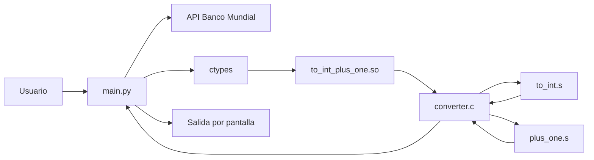
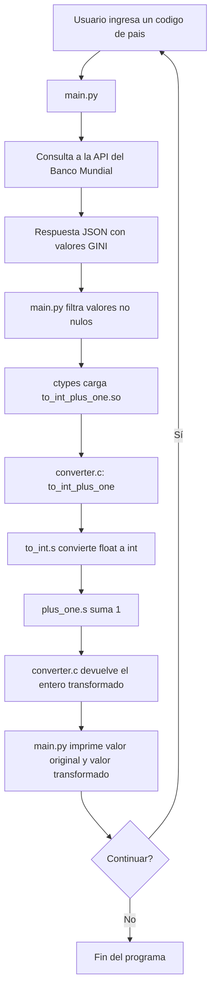
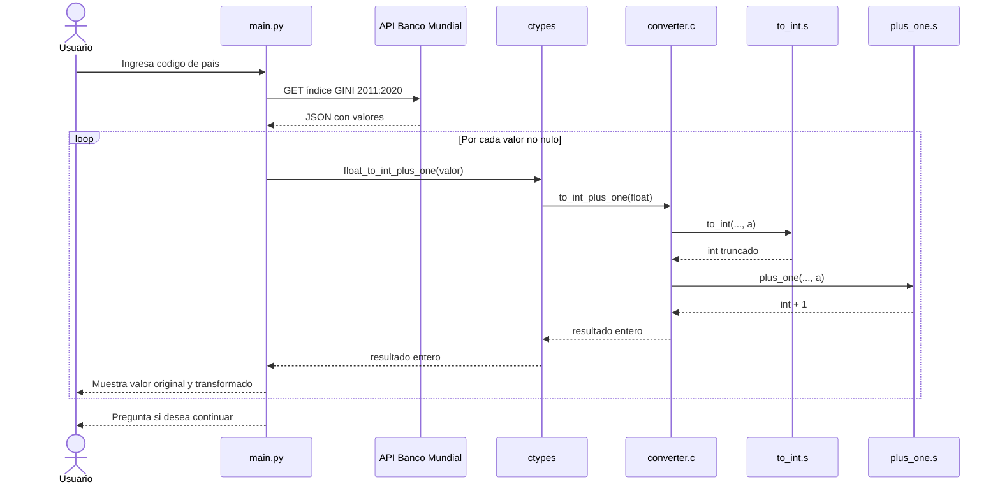

# TP2-Stack-Frame
Este es el repositorio del trabajo práctico N° 2 de la materia de Sistemas de Computación.

## Grupo
- *Ataque x86*

## Integrantes
- *Arnaudo, Federico Andres*
- *Perotti, Franco José*

# Script de Python - main.py

Este programa en Python consulta la API del Banco Mundial para obtener valores del indice GINI de un codigo de pais ingresado por el usuario (por ejemplo, `ar` o `arg`) entre 2011 y 2020.

Luego, utiliza la librería `ctypes` para cargar una biblioteca compartida escrita en C (`to_int_plus_one.so`) y llamar a una función que convierte cada valor flotante en entero y le suma uno. 

Finalmente, muestra tanto el valor original como el valor transformado, repitiendo el proceso hasta que el usuario decida finalizar.

## Diagramas del sistema

### 1. Diagrama de bloques




### 2. Flujo general



### 3. Diagrama de secuencia



# Comandos utilizados

Para compilar el proyecto:

```make```

Este comando:

- ensambla `to_int.s` y `plus_one.s`
- compila `converter.c`
- genera la biblioteca compartida `to_int_plus_one.so`

Para compilar con símbolos de depuración para GDB:

```make debug```

Este comando recompila el proyecto usando `-g -O0` en C y `--64 -g` en assembler.

Para ejecutar el script de Python:

```python3 ./main.py```

o bien:

```make run```

Nota: antes de ejecutar `main.py`, debe existir `to_int_plus_one.so`.


## Convención de llamada

Compilación normal del proyecto:

```as -o to_int.o to_int.s```

```as -o plus_one.o plus_one.s```

```gcc -Wall -fPIC -c -o converter.o converter.c```

```gcc -shared -o to_int_plus_one.so converter.o to_int.o plus_one.o```

Si se quiere depurar con GDB con símbolos de depuración, se puede usar directamente:

```make debug```

Equivale a recompilar manualmente con:

```as --64 -g -o to_int.o to_int.s```

```as --64 -g -o plus_one.o plus_one.s```

```gcc -g -O0 -fPIC -c -o converter.o converter.c```

```gcc -shared -o to_int_plus_one.so converter.o to_int.o plus_one.o```

## GDB

Antes de usar GDB, conviene recompilar la biblioteca con símbolos de depuración usando los comandos de la sección anterior.

Iniciar la ejecución con GDB:

    gdb --args python3 ./main.py

Como la biblioteca compartida se carga dinámicamente desde Python, antes de definir breakpoints conviene ejecutar:

    set breakpoint pending on

Detener en la función de C:

    break to_int_plus_one

También se puede detener en las rutinas ASM:

    break to_int
    break plus_one

Ejecutar el programa:

    run

Durante la ejecución, ingresar un código de país válido, por ejemplo `ar`, para que Python invoque la biblioteca compartida y se activen los breakpoints pendientes.

Entrar en las funciones:

    step [s]

Para avanzar instrucción por instrucción en ASM:

    stepi [si]

Ejecuta la siguiente línea sin entrar en funciones.

    next [n]

Para avanzar sin entrar en la siguiente instrucción ASM:

    nexti [ni]

Continúa la ejecución.

    continue [c]

Inspección útil en la función de C (`to_int_plus_one`):

    print numb_float
    next
    print result
    print $eax
    print $rax
    info registers rax rbp rsp
    x/4xg $rsp

Nota: `print result` funciona en el contexto de `to_int_plus_one` luego de avanzar una línea con `next`. En `to_int` y `plus_one` conviene inspeccionar registros y stack con `info registers` y `x/... $rsp`.
