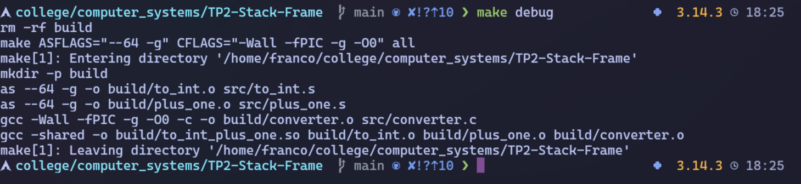
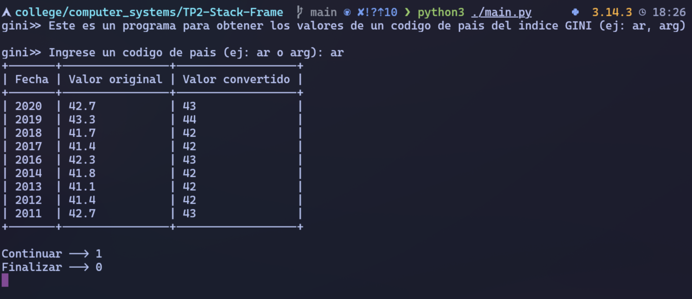
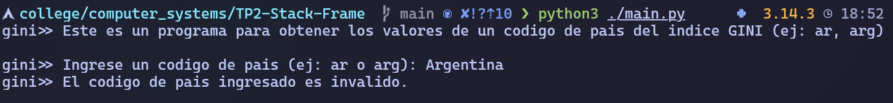
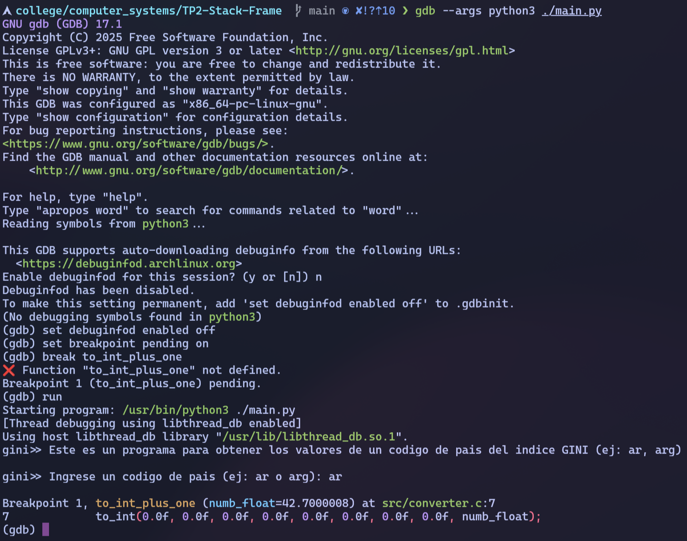
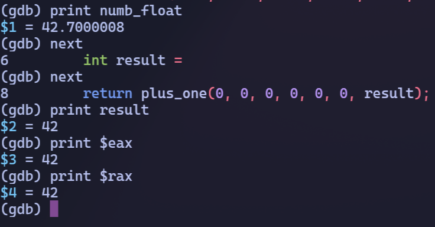
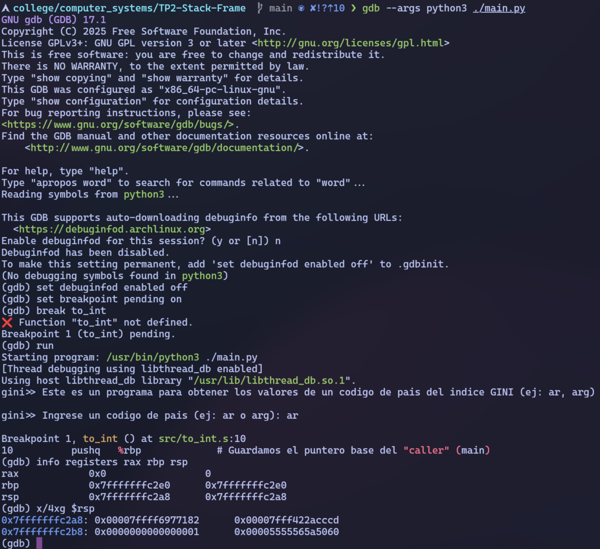
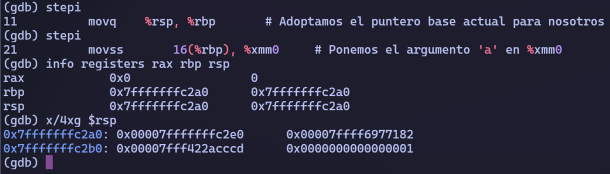
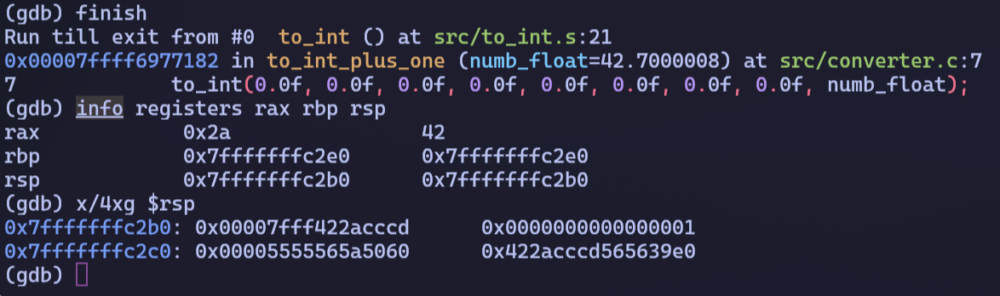
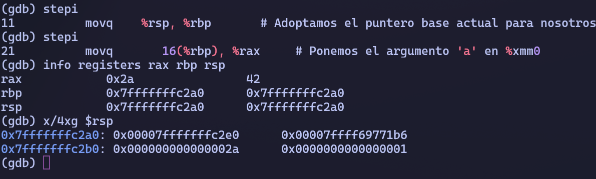
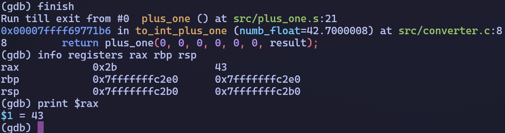

# Verificación del trabajo práctico

Este documento resume la verificación realizada sobre el trabajo práctico. El objetivo de esta instancia fue comprobar que la compilación, la ejecución del programa y la depuración con GDB funcionan correctamente con la estructura final del repositorio.

## Compilación

Primero se recompiló el proyecto con símbolos de depuración mediante el siguiente comando:

```bash
make debug
```

La compilación finalizó sin errores. Como resultado, se generaron correctamente los archivos `build/to_int.o`, `build/plus_one.o`, `build/converter.o` y `build/to_int_plus_one.so`.

<p align="center">
  
</p>
<p align="center"><em>Figura 1. Compilación exitosa del proyecto con símbolos de depuración mediante <code>make debug</code>.</em></p>

## Ejecución del programa

Luego se ejecutó el programa principal desde la raíz del repositorio:

```bash
python3 ./main.py
```

Para verificar el caso correcto de uso, se ingresó el código de país `ar`. El programa consultó la API del Banco Mundial, filtró los valores nulos y mostró en pantalla la tabla con el valor original y el valor transformado por la librería C/assembler.

En esta ejecución se confirmó que el flujo principal funciona correctamente y que la conversión `float -> int` seguida de la suma `+1` se refleja en la salida mostrada al usuario.

<p align="center">
  
</p>
<p align="center"><em>Figura 2. Ejecución correcta del programa con el código de país <code>ar</code> y visualización de la tabla de resultados.</em></p>

## Manejo de entrada inválida

También se verificó el comportamiento ante una entrada inválida. Para ello se volvió a ejecutar el programa y se ingresó `Argentina` en lugar de un código de país.

En este caso, el programa detectó correctamente que la entrada no correspondía a un código válido y mostró el mensaje de error previsto, sin interrumpirse de forma inesperada.

<p align="center">
  
</p>
<p align="center"><em>Figura 3. Manejo de entrada inválida: el programa detecta el error e informa que el código ingresado no es válido.</em></p>

## Verificación con GDB

Para validar la interacción entre Python, C y assembler se inició una sesión de GDB sobre el programa principal:

```bash
gdb --args python3 ./main.py
```

En esta etapa, GDB todavía está depurando el ejecutable `python3` y la librería compartida `build/to_int_plus_one.so` aún no fue cargada. Por ese motivo, los símbolos `to_int_plus_one`, `to_int` y `plus_one` todavía no están disponibles en el momento de abrir la sesión.

Como la librería se carga más adelante mediante `ctypes`, se utilizaron breakpoints pendientes. Esto permite que GDB acepte breakpoints sobre funciones todavía desconocidas y los resuelva automáticamente cuando la librería es cargada en memoria durante la ejecución.

```gdb
set breakpoint pending on
break to_int_plus_one
break to_int
break plus_one
run
```

Durante la ejecución de la sesión se ingresó nuevamente el código de país `ar`, de modo que el programa llegara efectivamente a la parte implementada en C y assembler.

## Detención en `to_int_plus_one`

La primera comprobación consistió en verificar que la ejecución alcanzara correctamente la función intermedia escrita en C, `to_int_plus_one`. Una vez detenido el programa en ese punto, se inspeccionaron el argumento recibido y el valor intermedio calculado:

```gdb
print numb_float
next
next
print result
print $eax
print $rax
info registers rax rbp rsp
x/4xg $rsp
```

La inspección mostró que `numb_float` contiene el valor original recibido desde Python y que, luego de avanzar una línea, `result` contiene el entero truncado devuelto por `to_int`. También se observó el valor de retorno en `%eax` y `%rax`, confirmando que la función de C cumple correctamente su papel de intermediación entre ambas capas.

<p align="center">
  
</p>
<p align="center"><em>Figura 4. Breakpoint alcanzado en <code>to_int_plus_one</code>, la función de C que vincula la capa Python con las rutinas en assembler.</em></p>

<p align="center">
  
</p>
<p align="center"><em>Figura 5. Inspección en GDB de <code>numb_float</code>, <code>result</code> y de los registros de retorno dentro de <code>to_int_plus_one</code>.</em></p>

## Análisis del stack en `to_int`

Para estudiar el uso del stack frame en la rutina de conversión, se repitió la ejecución deteniéndose en `to_int` y observando tres momentos: antes del prólogo, durante la construcción del stack frame y después del retorno.

Los comandos usados en esta verificación fueron:

```gdb
break to_int
run
info registers rax rbp rsp
x/4xg $rsp
stepi
stepi
info registers rax rbp rsp
x/4xg $rsp
finish
info registers rax rbp rsp
x/4xg $rsp
```

El análisis mostró que:

- antes del prólogo, el stack todavía pertenece al caller
- luego de `push %rbp` y `mov %rsp, %rbp`, la función crea su propio stack frame (`rbp == rsp`)
- el argumento útil puede ubicarse en `16(%rbp)`
- al finalizar la rutina, el entero convertido queda almacenado en `%rax` y `%rbp` vuelve a su valor antes de la llamada.

Estas observaciones son consistentes con el uso deliberado del stack para pasar parámetros adicionales desde C hacia assembler.

<p align="center">
  
</p>
<p align="center"><em>Figura 6. Estado del stack y de los registros inmediatamente antes de ejecutar el prólogo de <code>to_int</code>.</em></p>

<p align="center">
  
</p>
<p align="center"><em>Figura 7. Estado del stack durante <code>to_int</code>, una vez creado el stack frame con <code>push %rbp</code> y <code>mov %rsp, %rbp</code>.</em></p>

<p align="center">
  
</p>
<p align="center"><em>Figura 8. Estado del stack tras finalizar <code>to_int</code> y observación del valor de retorno almacenado en <code>%rax</code>.</em></p>

## Análisis del stack en `plus_one`

Finalmente, se repitió el mismo tipo de análisis sobre `plus_one`, la rutina encargada de sumar `1` al entero recibido.

Para esta parte se utilizaron los siguientes comandos:

```gdb
break plus_one
run
info registers rax rbp rsp
x/4xg $rsp
stepi
stepi
info registers rax rbp rsp
x/4xg $rsp
finish
info registers rax rbp rsp
```

La observación del stack confirmó que el entero llega a la rutina por stack, que puede recuperarse desde `16(%rbp)` luego de armado el stack frame, y que el resultado final vuelve a quedar visible en `%rax` al terminar la ejecución.

De esta forma, la evidencia obtenida en GDB muestra el comportamiento esperado antes, durante y después de la ejecución de la rutina, en línea con lo pedido por la consigna.

<p align="center">
  
</p>
<p align="center"><em>Figura 9. Estado del stack y de los registros al ingresar en <code>plus_one</code>, antes de ejecutar su prólogo.</em></p>

<p align="center">
  
</p>
<p align="center"><em>Figura 10. Estado del stack durante <code>plus_one</code>, con el argumento accedido desde <code>16(%rbp)</code>.</em></p>

<p align="center">
  
</p>
<p align="center"><em>Figura 11. Resultado final observado en <code>%rax</code> luego de completar la ejecución de <code>plus_one</code>.</em></p>

## Conclusión

La verificación realizada permitió confirmar que:

- el proyecto compila correctamente con símbolos de depuración
- el flujo principal del programa funciona con una entrada válida
- la aplicación maneja entradas inválidas sin fallas inesperadas
- la capa Python invoca correctamente a la librería compartida
- las rutinas en assembler reciben parámetros por stack y devuelven el resultado conforme a la convención observada en GDB

